# gimp-forensics

Image forensics for GIMP 3: twelve non-destructive filters under
**Filters > Forensics** (GEGL operations), **JPEG Info** and the
**Forensics Workbench** under **Image > Forensics**. The Workbench puts
all of them side by side as layers.

| Filter | Operation | Shows |
|---|---|---|
| Error Level Analysis | `forensics:error-level` | how much each pixel changes when the image is saved again as a JPEG |
| JPEG Ghost | `forensics:jpeg-ghost` | where the image differs least from a JPEG copy at a chosen quality (Farid 2009) |
| Noise Analysis | `forensics:noise` | the noise of the image: the image minus a denoised copy |
| Wavelet Noise Map | `forensics:wavelet-noise` | the noise level of each block, from the finest wavelet details (Mahdian and Saic 2009) |
| Min/Max Deviation | `forensics:minmax` | the pixels darker or brighter than all their neighbours, or their density |
| Bit Planes | `forensics:bit-plane` | one bit of the 8 bit values |
| Echo Edge Filter | `forensics:echo` | the Laplacian, strongly amplified: blurred regions stay dark |
| Luminance Gradient | `forensics:luminance-gradient` | how the brightness changes, as a color |
| Clone Detection | `forensics:clone-detect` | parts copied to another place of the image (Fridrich et al. 2003) |
| Median Filtering Detection | `forensics:median-detect` | blocks with the streaking of a median filter (Kirchner and Fridrich 2010) |
| Resampling Detection | `forensics:resampling` | periodic traces of interpolation (Popescu and Farid 2005, Kirchner 2008) |
| Principal Components | `forensics:pca` | the image along a principal component of its colors |

The second six follow tools of [Sherloq](https://github.com/GuidoBartoli/sherloq)
(Guido Bartoli and contributors, GPL-3.0), see "Tools after Sherloq"
below.

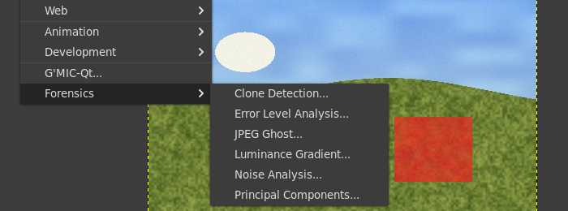

**Image > Forensics > JPEG Info...** reads the JPEG file an image came
from: the quantisation tables and the quality of the last save, whether
they are those of a known camera or program (JPEGsnoop's signatures),
signs of an earlier save (double compression) and a map of where the file
looks saved twice and where once, the metadata that tells of software,
and the Exif thumbnail against the image. See "JPEG Info" below.

**Image > Forensics > Content Credentials...** shows the Content
Credentials (C2PA provenance) of the file an image came from: who signed
it and when, the actions and ingredients, whether generative AI is
declared, and whether the credentials are valid, from an unknown signer,
tampered, or missing. It reads; it never writes. See
[docs/content-credentials.md](docs/content-credentials.md); GIMP drops
credentials when it exports, see
[docs/content-credentials-plan.md](docs/content-credentials-plan.md).

## What these tools show, and what they do not prove

Every one of these analyses is an **indicator, not proof**. Each shows a
property of the pixels (how they react to a JPEG save, their noise, their
gradients, repeated blocks) that differs between parts of an image for
many reasons, most of them innocent: content (edges, texture, flat sky),
earlier edits that are not forgeries (a crop, a resize, a color
correction over the whole picture), the camera's own processing, and
repeated patterns in the scene. The forensic literature and the tools
this work follows say the same:

- FotoForensics (Neal Krawetz), [ELA tutorial](https://fotoforensics.com/tutorial-ela.php):
  "ELA only identifies what regions have different compression levels.
  It does not identify sources." and "ELA is only one algorithm. The
  interpretation of results may be inconclusive. It is important to
  validate findings with other analysis techniques and algorithms."
- FotoForensics [FAQ](https://fotoforensics.com/faq.php): "ELA also does
  not detect all forms of digital manipulation; it only identifies
  differences in the JPEG compression rate. Digital modifications that do
  not significantly alter the error level potential, such as a minor
  color adjustment over the entire picture, may not be detected by ELA."
- Forensically (Jonas Wagner), [help](https://29a.ch/photo-forensics/):
  a tool that "can't tell true from false", and "absence of evidence is
  still not evidence of absence".
- Farid ("Exposing Digital Forgeries from JPEG Ghosts", 2009) measures
  his ghosts with a statistical test and a threshold chosen for under 1 %
  false positives, and notes that a region moved off the 8 x 8 JPEG grid
  loses its ghost.

Use the results to decide where to look closer, together with other
evidence (the file's history, metadata, the original from its source).
The tests below show on synthetic images both what each filter finds and
where it is weak.

## Why GEGL filters

GIMP 3 edits non-destructively only with GEGL operations: a filter on a
layer that can be switched off, changed later (with the live preview on
the canvas) and is kept in the XCF file. The GIMP 2 tools these replace
were scripts that saved a temporary JPEG, loaded it and merged a
difference layer; every change of setting meant running them again. As
GEGL operations the analyses run in memory, on any precision, with the
live preview, and the Workbench only arranges them. All of them have one
input, so GIMP keeps them non-destructive (GIMP 3 merges filters that
have a second image input at once, app/tools/gimpfiltertool.c).

**Filters > Forensics**: GIMP-ELA already used that name for its menu;
it keeps the tools together instead of scattering them over Colors,
Enhance and Edge-Detect, none of which fits an analysis. GIMP 3.2
creates the submenu from the operations' `gimp:menu-path` key (checked
in GIMP 3.2.6 on Broadway, picture above). The Workbench is under
**Image > Forensics** because it works on the image (it adds a layer
group), not on one layer.

## Error Level Analysis

The image is saved again as a JPEG at a known quality, in memory with
libjpeg (the libjpeg-turbo of GIMP's Flatpak), and the difference is
shown, amplified (Krawetz, "A Picture's Worth...", Black Hat 2007). Parts
of a JPEG image that were saved as often, on the same block grid, change
about as much; a region pasted from another picture or painted over often
changes more (or less).

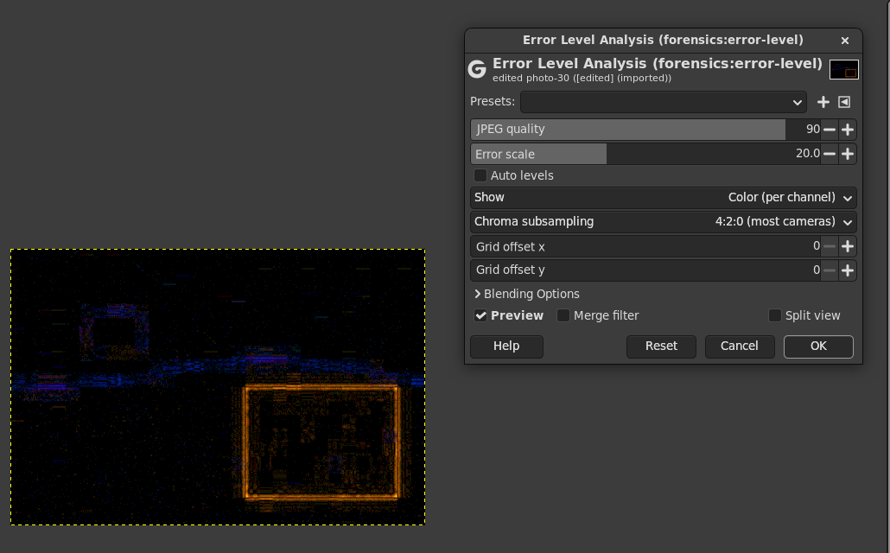

Settings and defaults:

- **JPEG quality**, 90: Forensically's default. Krawetz's paper uses 95,
  FotoForensics 75 ("This system uses libjpeg-6b with a resave quality
  of 75% and a post-process brightness factor of 20", its FAQ), GIMP-ELA
  and elsamuko's script 70 (0.7 on GIMP 2's scale).
- **Error scale**, 20: Forensically's default, FotoForensics' brightness
  factor. Or **Auto levels**: the 99.4th percentile of the error becomes
  white, as GIMP's Levels "Auto Input Levels" (0.6 % clipped) that the old
  scripts used, but with one scale for all channels, so that the colors
  of the error stay comparable. Auto levels needs the whole image.
- **Show**: the error per channel (color, as the old scripts), of the
  JPEG luma Y, or of the channel that changed most.
- **Chroma subsampling**, 4:2:0: what most cameras and GIMP 2's JPEG
  export with the old scripts' settings wrote (`file-jpeg-save` with
  subsampling 0, which is 4:2:0 for RGB in GIMP 2.10's file-jpeg). 4:2:2
  and 4:4:4 too.
- **Grid offset x, y**, 0 to 15: ELA is only meaningful on the JPEG block
  grid of the original file, which starts at its top left corner. A crop
  moves it: after cropping c pixels from the left, set x to
  (16 - c mod 16) mod 16 (the same for the top). 0 to 7 moves the 8 x 8
  blocks; 8 to 15 matter for the 16 x 16 chroma blocks of 4:2:0 (and
  4:2:2 across). Pixels left of and above the first grid line lie in a
  partial block, filled with copies of the edge pixels.

The analysis works on the image's 8 bit encoded values, as a JPEG file
holds them: 16 bit and float images are rounded to 8 bit for the round
trip (that is the point), NaN counts as 0, values beyond 0 to 1 are
clamped; the output is float, alpha passes through. The round trip runs
on pieces cut on the JPEG block lines (with one block of margin where
chroma is subsampled), in parallel, and gives exactly the pixels of a
round trip of the whole image (tested). A JPEG exported by GIMP with the
same settings decodes to exactly the filter's JPEG copy (tested).

What it shows in the tests (synthetic scenes; `tests/check-error-level.c`):

- A quality 90 JPEG with a region pasted from a never compressed copy,
  analysed as edited: the region's mean error is 25 times the rest's,
  90 % of its 16 x 16 blocks lie above the 99th percentile of the other
  blocks (a threshold that flags 1 % of them by construction). From a
  quality 70 copy on a grid 4 pixels off: 15 times, 72 % above the 95th
  percentile. From a quality 70 copy on the same grid: 5 times on
  average, but only 21 % of its blocks above the 95th percentile.
- **The same images saved again at quality 90**: now every block has
  been saved at 90; the region is still brighter on average (2.2 to 3.4
  times, in scattered blocks), and at ELA quality 95 it hardly differs
  (1.4 times). This is where ELA is weak.
- A never compressed texture: uniform error (256 blocks of 32 x 32
  within 1.6 % of each other). Quality 100 (4:4:4): 0.48 levels on
  average, against 2.6 at quality 90. Moving the grid by 4 pixels on a
  JPEG image raises the error from 0.12 to 1.39 levels on average; a
  4 pixel crop analysed with offset 12 gives the pixels of the uncropped
  analysis.

## JPEG Ghost

After H. Farid, ["Exposing Digital Forgeries from JPEG Ghosts"](https://farid.berkeley.edu/downloads/publications/tifs09.pdf),
IEEE Transactions on Information Forensics and Security 4 (1), 2009. A
region saved at a lower quality q0 before it was pasted in, the whole then
saved at q1, differs least from a copy saved at q0: at that quality the
region shows up dark. The image is saved again at a sweep of qualities;
for each, the squared difference averaged over the three channels and a
b x b window (equation 3, in 8 bit levels), then normalised per pixel over
the sweep into 0 to 1 (equation 4).

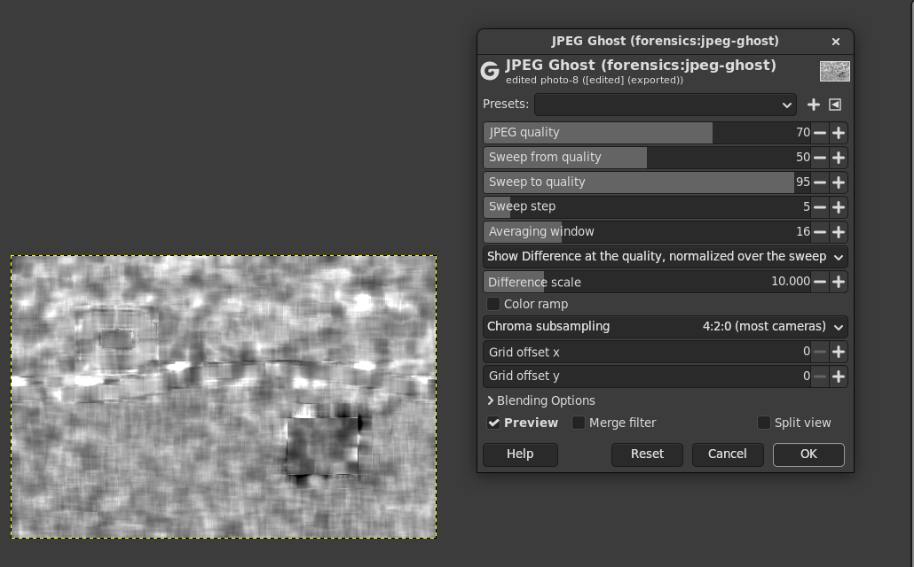

- **JPEG quality**, 70: the quality shown. **Sweep** 50 to 95 in steps of
  5 (Farid swept 30 to 90 in steps of 1 for his statistics and shows 60
  to 98 in steps of 2): the qualities of the normalisation.
- **Averaging window**, 16: Farid's b.
- **Show**: the normalised difference (Farid's figures), the averaged
  difference itself (its root, in levels times a scale), or the quality
  of the sweep with the smallest difference (a map: black the lowest).
- **Color ramp**: blue, green, red for 0, 0.5, 1, as in the GIMP 2 JPEG
  Ghost plug-in of Bernardo Bulgarelli Labronici (GPL-3+, SourceForge
  "Gimp Forensics"), which was read for what users expect.
- Chroma subsampling and grid offset as in Error Level Analysis (Farid's
  remedy for a region off the grid is to try all offsets).

The window is centred on the pixel (Farid's sums start at it) and clipped
to the image. Tests (`tests/check-jpeg-ghost.c`): Farid's experiment on a
synthetic scene (a 192 x 160 region saved at 60, the whole at 85): at
quality 60 the region's normalised difference is 0.26 against 0.79
elsewhere, a two-sample Kolmogorov-Smirnov statistic of 0.80 (Farid's own
forgeries score 0.84 and 0.92; the untouched image here 0.11); the best
quality of a sweep 40 to 80 is 60 in the region and 80 elsewhere. Off the
grid by 4 pixels the ghost is gone (0.12); a cropped image gets it back
with the grid offset (0.80 against 0.07).

## Noise Analysis

The image minus a denoised copy, amplified, as Forensically's Noise
Analysis ("basically a reverse denoising algorithm"). A picture from one
camera at one ISO has one noise level; a region pasted from another
picture, painted, blurred or airbrushed often has more or less noise.

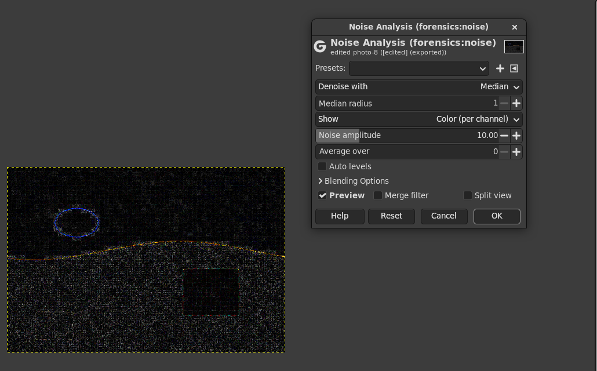

- **Denoise with**: a median of 3 x 3 to 7 x 7 (Forensically uses a
  median), or the finest level of the "a trous" wavelet transform (the
  B3 spline).
- **Show**: the size of the noise per channel or of the luma, or the
  signed luma noise around gray. **Noise amplitude**, 10.
- **Average over**: a window, for a map of the local noise level.
  **Auto levels** as in Error Level Analysis.

Tests (`tests/check-noise.c`): on a smooth texture, a region with 6
levels of noise in 2 has every one of its blocks above the 99th
percentile of the others, and an airbrushed one (no noise) every block
below the 1st. On the photo-like scene, whose fine texture varies more
from block to block than the noise does, the region's mean differs by
1.6 to 2.5 times (0.54 to 0.57 when airbrushed), but block by block it
is not separated: noise analysis works best on smooth areas (sky, skin,
walls).

## Luminance Gradient

How the brightness changes along x and y, as a color, after
Forensically's Luminance Gradient: surfaces that face the light the same
way get similar colors; an object pasted from a picture with other light,
or edges much sharper or softer than the rest, can stand out. Central
differences of the luma, shown as a normal map (flat is light blue;
intensity 8 gives Forensically's default slope), as a hue for the
direction with the size as brightness, or as gray for the size.

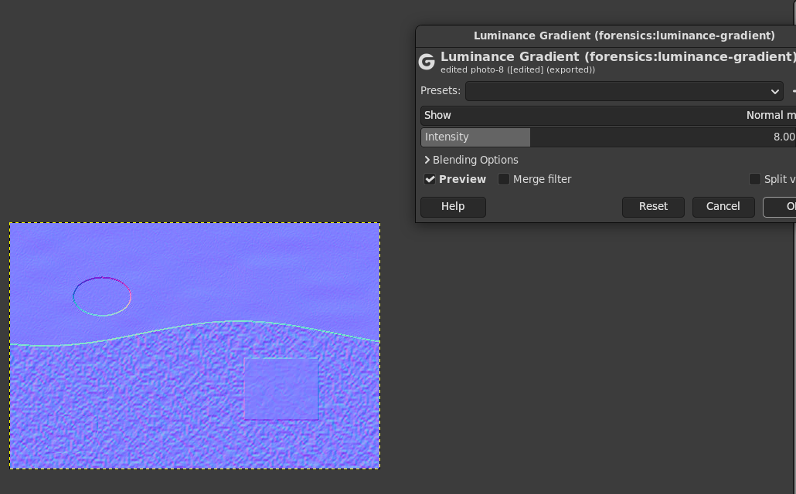

Tests (`tests/check-luminance-gradient.c`): of twelve spheres lit from
the left, the one lit from the right is the only one on the other side
of 0.5 in red (0.45 against 0.55); a hard pasted edge shows three times
the gradient of a soft one.

## Clone Detection

Parts of the image copied to another place of it (the clone tool, copy
and paste within the picture), after J. Fridrich, D. Soukal and J. Lukas,
"Detection of Copy-Move Forgery in Digital Images" (DFRWS 2003): every
16 x 16 block, at every position, gets the quantised low frequencies of
its DCT; the blocks are sorted by them, so that equal blocks meet; pairs
of equal blocks at least a block apart vote for their shift; shifts with
40 votes or more are copies. Before a pair counts, its pixels are
compared: they must differ by at most the tolerance (2 levels) and a
quarter of the blocks' detail, and neither block may match itself moved
3 pixels (straight edges and stripes match along themselves and are left
out). Blocks with little fine detail (flat or smooth areas) are not
compared (Forensically's "minimal detail").

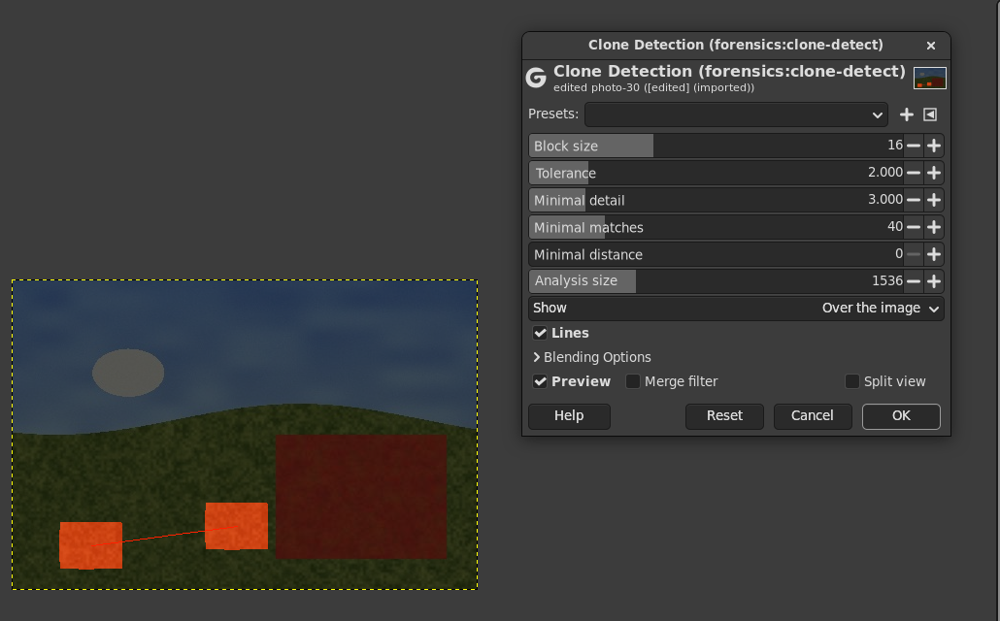

It needs the whole image. Images larger than the **analysis size**
(1536 pixels on the longer side) are reduced by a whole factor first (a
box average and a light smoothing, so that a copy moved by a fraction of
the factor still matches): a 12 megapixel image is analysed at
1333 x 1000. A square copy of s x s analysis pixels holds (s - 15)^2
pairs of 16 x 16 blocks, so with 40 votes needed it must be about 22 x 22
analysis pixels (66 x 66 in that image) to be found; lower Minimal
matches or raise the analysis size for smaller ones. Shown over the darkened image
in a color per shift, with lines from original to copy, or as a mask.

Tests (`tests/check-clone-detect.c`): a 64 x 64 clone on textured ground
is found whole (also off the block grid, 99 % of it after a JPEG save at
90) with nothing else marked; an image without clones stays clean; a
flat sky and a straight edge across the image are not matched; a
4000 x 3000 image with a 256 x 256 clone: 86 % and 90 % of the two found,
under 0.1 % of the rest (a real near copy in the generated sky), 1.1 s.
**Repeating patterns (tiles, bricks, fences, sums of sines) are found as
copies too**: they are copies. Rotated, scaled or mirrored copies are not
found.

## Principal Components

The image along a principal component of its colors (the eigenvectors of
the covariance of all R'G'B' values), as Forensically's PCA and
Krawetz's principal component analysis: the first component is mostly
the brightness; the second and third hide what most of the image shares
and can show a region whose colors relate differently (a recolor, a paste
from a picture with another white balance). Projection around gray
(2 standard deviations to 0 and 1) or the distance from the component.
Needs the whole image. Tests (`tests/check-pca.c`): components recovered
from known directions (correlation 0.9999 or more); a region moved off
the image's color plane stands out 6.7 times on the third component.

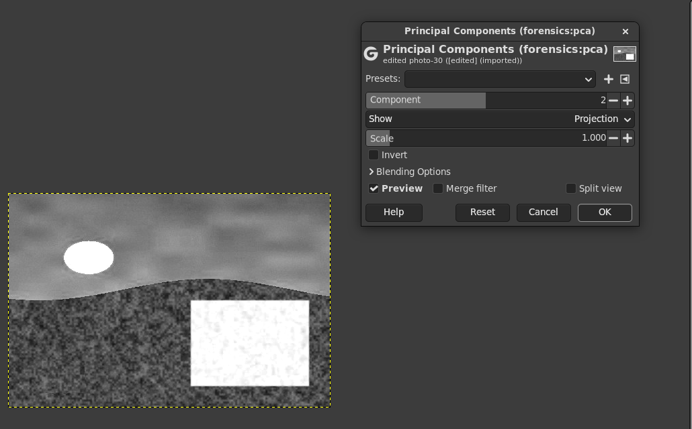

## Tools after Sherloq

[Sherloq](https://github.com/GuidoBartoli/sherloq) (Guido Bartoli and
contributors, commit 3fe95fc of 2026-07-16) is a Python and Qt toolkit of
image forensics. Its source was read tool by tool; its licence is the GNU
GPL version 3 (LICENSE, and "GNU GPLv3" in its About box), so its code
could be ported here with credit. The operations below are written for
this repository in C after Sherloq's methods and the papers they follow;
each file names the Sherloq file and the paper. Where Sherloq's own
method was weaker than the published one (a trained model of unknown
data, an EM with random start values), the published statistic is used
instead, and the file says so. Numbers from the tests are on synthetic
images; the samples ([samples/README.md](samples/README.md)) have numbers
on real photographs. All of them work on the image's 8 bit values, as
Sherloq reads images, and pass alpha through.

### Wavelet Noise Map

The noise level of each block from the finest diagonal wavelet details,
after B. Mahdian and S. Saic, "Using noise inconsistencies for blind
image forensics", Image and Vision Computing 27 (10), 2009, as Sherloq's
Wavelet Blocking (`tools/noise/noise_estimmation.py`): one level of the
Daubechies 8 transform of the gray image (pywt's `db8`, symmetric
extension), its HH subband in blocks of b x b coefficients (2b x 2b
pixels), and in each block median(|HH|) / 0.6745. A picture from one
camera at one ISO has about one noise level; a region pasted from
another, or blurred or denoised, can have another. Texture and edges
raise the estimate too (much less than they raise a mean): compare
similar content. Shown as gray (the level in 8 bit levels x gain / 255),
or normalised as Sherloq shows it (the whole image, lowest block black,
highest white). Like Sherloq, the paper's merging of blocks into regions
is left out.

Tests (`tests/check-wavelet-noise.c`): the filter's numbers (sum sqrt 2,
orthonormal, 8 vanishing moments, within 2e-12); the same as a brute
force transform; white noise of sigma 3 is estimated at 3.015 and a
region of sigma 8 at 8.05; a smooth ramp at 0.2 levels (its 8 bit
rounding).

### Min/Max Deviation

The pixels darker than all 8 neighbours (minima, green) or brighter than
all of them (maxima, red), as Sherloq's Min/Max Deviation
(`tools/noise/minmax.py`, strict comparisons on the 8 bit channel), or
their share in a window (Sherloq's "filter" is a block standard deviation
of that map; a share is easier to read). Sensor noise makes about one
pixel in nine an extremum each way; smooth, blurred, interpolated,
denoised or soft painted areas few; flat or clipped ones none. Tests:
independent noise gives 0.1087 and 0.1081 (0.1092 expected with 256
levels); a 3 x 3 blurred region 0.24 times the density of the rest;
against a brute force reference.

### Bit Planes

One bit of the 8 bit value of the luma (OpenCV's gray, as Sherloq), a
color channel or the RGB norm, as Sherloq's Bit Planes Values
(`tools/noise/planes.py`). The low planes of a photograph look like
noise; a region with other processing can show structure or flat areas
there (and hidden data can show in plane 0). Sherloq's RGB norm is not
divided by the square root of 3 and wraps around past 255; here it is.
Tests: every bit of every channel exact against the values computed in
the test.

### Echo Edge Filter

The size of the Laplacian of each channel, normalised over the image and
brightened by a contrast curve, exactly as Sherloq's Echo Edge Filter
(`tools/detail/echo.py`: `cv.Laplacian` with ksize 2 radius + 1,
`cv.normalize` to 0 to 255, `create_lut (0, contrast)`), with OpenCV's
kernels and its mirrored edges. Detail and noise light up; a region out
of focus while its surroundings are sharp, or blurred afterwards, stays
dark. Tests: an impulse shows OpenCV's kernels for ksize 3, 5 and 7; the
same as a reference in 60 cases; a blurred region 0.56 times the rest.

### Median Filtering Detection

Blocks with the traces of a median filter, after M. Kirchner and J.
Fridrich, "On detection of median filtering in digital images", Proc.
SPIE 7541, 2010: a median leaves "streaking", runs of equal neighbours,
so that first differences of 0 are much more frequent than of +-1 even
where there is texture. Per block the ratio h0 / h1 of those counts in
R, G and B (the gray of three channels filtered separately hides the
runs); red above the threshold (0.8), green below, blue where the block
is too flat to judge (Sherloq's colors). Sherloq's Median Filtering
(`tools/various/median.py`) classifies blocks with a 28 MB XGBoost model
of image quality metrics, trained on data it does not describe; this
uses the published statistic.

How reliable: on images never saved as JPEG it separates well. In the
tests a 3 x 3 or 5 x 5 median region is red in all of its judged blocks
and nothing else is (a 3 x 3 box blur is not taken for a median); after
one JPEG save at quality 90 the same region shows nothing. On the
samples a median filtered region of a photo saved as PNG is red in all
its judged blocks, but 5 % of the other blocks are red too, and on
untouched JPEG files 0.3 % to 45 % of the blocks are (the most on a
phone photo, whose own denoising looks like a median); saved as JPEG the
region shows nothing. Use it on PNG, TIFF and raw conversions, compare
with similar content, and not on JPEG files.

### Resampling Detection

Periodic traces of interpolation in blocks: a region enlarged, shrunk or
rotated before it was pasted has pixels that are weighted sums of their
neighbours with weights that repeat, so how well a pixel is predicted
from its neighbours repeats, and the spectrum of that "probability map"
has peaks (A. C. Popescu and H. Farid, "Exposing Digital Forgeries by
Detecting Traces of Re-sampling", IEEE Transactions on Signal Processing
53 (2), 2005). Sherloq's Image Resampling (`tools/tampering/resampling.py`)
fits the predictor by EM from random start values, which takes minutes
per image; here the predictor is fixed, as in M. Kirchner, "Fast and
reliable resampling detection by spectral analysis of fixed linear
predictor residue", ACM MM&Sec 2008 (p = exp(-e^2)). The score of a block
is the highest peak of its windowed DFT over the median, leaving out the
centre and the frequencies of the JPEG grid. Shown as the score, each
block's spectrum (as the figures of the paper) or the probability map.

How reliable: only on images never saved as JPEG, and for enlargements.
In the tests a region enlarged by 1.2 (bilinear) or 1.5 (bicubic) scores
above every block elsewhere, one enlarged by 1.2 or 1.1 (bicubic) with
most of its blocks; one shrunk to 0.8 does not stand out, and after a
JPEG save at 95 the enlarged region no longer does. On a real photo
(a piece of the lake enlarged by 1.25 and saved as PNG) it is a hint
only: the region's median score 6.2 against 4.8 elsewhere, with 8.5 % of
the other blocks above it; saved as JPEG the region is gone. Scans of
printed pictures score high everywhere (the halftone is periodic too).

### Evaluated, not built

- **Contrast Enhancement** (Sherloq's `tools/tampering/contrast.py`, after
  X. Lin, X. Wei and C.-T. Li, "Two Improved Forensic Methods of
  Detecting Contrast Enhancement in Digital Images"): reproduced in
  numpy on a test image with a 256 x 256 region changed. A linear stretch
  of 30 to 220 stands out (block median 1.0 against 0.27), but a gamma of
  0.7 overlaps with ordinary blocks (median 0.45, while 5 % of the
  unchanged blocks score 0.67 or more), and after a JPEG save at 90 the
  region scores lower than the rest. Not built: it would mostly mislead.
- **Composite Splicing**: Sherloq's tool is Noiseprint (D. Cozzolino and
  L. Verdoliva), a neural network with 186 MB of weights under a licence
  for nonprofit use only; not free, not built. The DCT statistics idea
  it is described with is built instead, in JPEG Info: the double JPEG
  map (below).
- **Multiple Compression** (`tools/jpeg/multiple.py`) plots the loss of
  recompression over the quality; the machine learning part is the
  model `jpeg_qf.mdl` that `quality.py` uses to guess the quality of
  files that are not JPEG. Skipped, as asked; JPEG Info reads the
  quality of a JPEG file from its tables instead.
- **PRNU Identification** needs reference images from the camera in
  question; a plug-in for it is in PLAN.md. **Illuminant Map** is listed
  by Sherloq but has no code there.

## JPEG Info

**Image > Forensics > JPEG Info...** reads the JPEG file the image was
opened from (never the pixels GIMP decoded) in pure Python
(`plug-ins/jpeg-info/jpeg_report.py`), and never writes it.

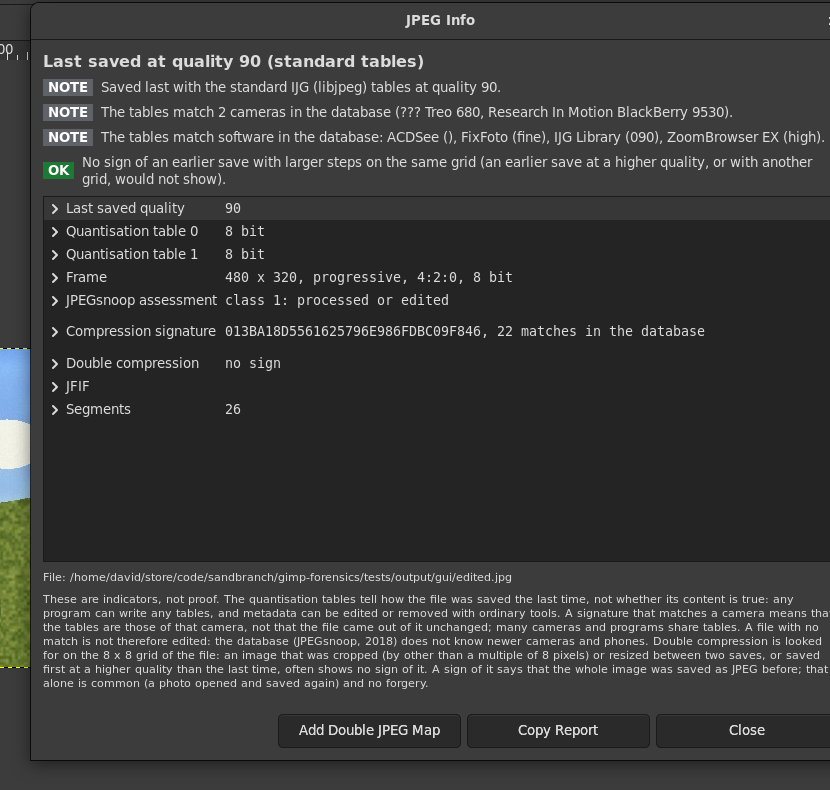

- **The quality of the last save**, from the quantisation tables: exactly
  the IJG tables (libjpeg's `jpeg_quality_scaling` and
  `jpeg_add_quant_table`, integer arithmetic, baseline clamping) at some
  quality, which GIMP, Pillow and most programs write, or one of
  mozjpeg's other base tables (its `jcparam.c`), or else the nearest IJG
  quality less the mean deviation, as Sherloq estimates it
  (`tools/jpeg/quality.py`). The tables themselves are shown.
- **Whose tables they are**: the compression signature of JPEGsnoop
  (Calvin Hass, GPL-2.0-or-later; the MD5 of the tables written its way,
  checked against the 247 IJG entries of its database) looked up in
  JPEGsnoop's database of 3328 cameras and programs
  (`jpegsnoop-signatures.tsv`, made by `update-signatures.py` from its
  `Signatures.inl`), and JPEGsnoop's assessment: class 1 processed or
  edited, 2 probably processed, 3 probably original (the tables match the
  camera the Exif data name), 4 uncertain. The database is from 2018: a
  phone of today is unknown to it, which alone means nothing.
- **Double compression**: the file's own DCT coefficients, decoded from
  its entropy coded data (sequential and progressive files, restart
  markers; the same numbers as libjpeg for every fixture and sample),
  are tested against a model of two saves on the same grid (J. Lukas and
  J. Fridrich, "Estimation of Primary Quantization Matrix in Double
  Compressed JPEG Images", DFRWS 2003; A. C. Popescu and H. Farid,
  "Statistical Tools for Digital Forensics", 2004; the maximum likelihood
  of Z. Fan and R. L. de Queiroz, 2003): per frequency the first
  quantisation step that fits best, and how much better than a single
  save. "Likely" when three or more frequencies gain 0.1 nats per block
  or more with a coarser first step; the first save's quality is then the
  one whose table fits those steps. In the tests a file saved at 70 and
  then 90 is found with 70, one saved at 50 and then 85 with 51; single
  saves score at most 0.016. What does not show: a first save finer than
  the last (90 then 75), and grids that do not line up (a crop by 3
  pixels between the saves).
- **Double JPEG map** (Add Double JPEG Map): per 8 x 8 block, how likely
  it was saved twice with a coarser first step (white) or once (black):
  the histograms as a mixture of the two models (after T. Bianchi and A.
  Piva, "Image Forgery Localization via Block-Grained Analysis of JPEG
  Artifacts", IEEE TIFS 7 (3), 2012), each block's likelihood ratio over
  the 3 x 3 blocks around it. A region never saved as JPEG pasted into a
  JPEG that was then saved again shows black in white (tested); a region
  pasted from a coarser JPEG shows white in black (the GUI test's photo,
  picture below). Small regions and smooth content give little evidence.
- **Metadata that tells of software**: Exif (camera, software, dates,
  maker notes), XMP (creator tool, editing history), Photoshop's quality
  settings (Save As, APP13, and Save for Web, APP12 "Ducky", as JPEGsnoop
  decodes them), ICC, Adobe, MPF, C2PA, comments, data after the end.
- **The Exif thumbnail**: its size, its tables, its black bars, and a
  comparison with the image scaled to it (after E. Kee and H. Farid,
  "Digital Image Authentication from Thumbnails", SPIE 2010, and
  Sherloq's `tools/metadata/thumbnail.py`): a thumbnail of another shape
  than the image means it was cropped or resized after the thumbnail was
  made, or that the camera squeezes its thumbnails (the Sony RX100 of the
  samples does); one whose pixels differ, that the image changed. **Add Thumbnail
  Layers** puts the thumbnail, stretched to the image inside its bars,
  over a copy of the image in Difference mode.

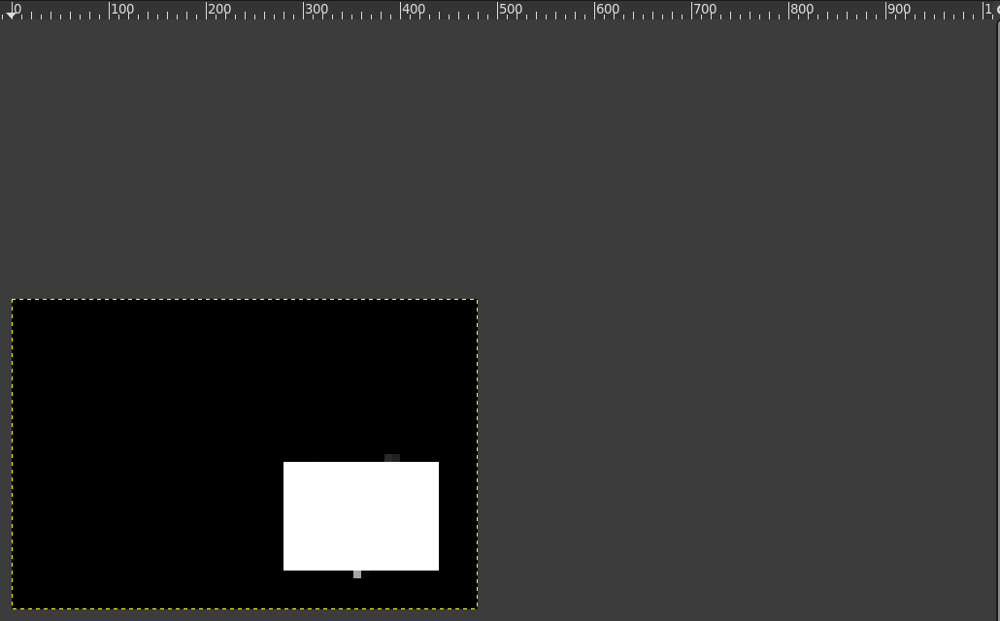

Scripts: `plug-in-forensics-jpeg-info` returns the report as JSON; with
`add-thumbnail` and `add-double-map` it adds those layers. The
Workbench uses it.

## Forensics Workbench

**Image > Forensics > Analyze Image...** adds a layer group "Forensics"
at the top of the image with one copy of the image as it looks (the
visible layers, flattened) per analysis, each carrying its analysis as a
filter that can be edited later: Error Level Analysis, JPEG Ghost, Noise
Analysis, Wavelet Noise Map, Min/Max Deviation (its density), Echo Edge
Filter, Luminance Gradient, Clone Detection, a level sweep (GEGL's Levels
on a narrow band of brightness: Forensically's "Level Sweep", to move by
editing the filter), principal components 2 and 3, and on demand Median
Filtering and Resampling Detection, Bit Plane 0, and the HSV and LAB
channels (GEGL's Extract Component). For an image opened from a JPEG
file it asks JPEG Info for the file's quality: Error Level Analysis then
resaves at the quality of the file's last save (where parts saved as
often change least, and a part with another history stands out), and
JPEG Ghost uses the quality of an earlier save if one shows ("Use the
file's JPEG quality", on by default; the dialog says what it found); and
it adds JPEG Info's double JPEG map and the Exif thumbnail over the image
to the group. Only the top analysis is visible; switch with the eye
icons. The image's own layers are not touched; a second run puts a new
group on top and hides the earlier one.

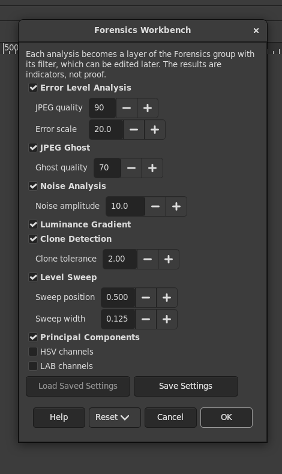
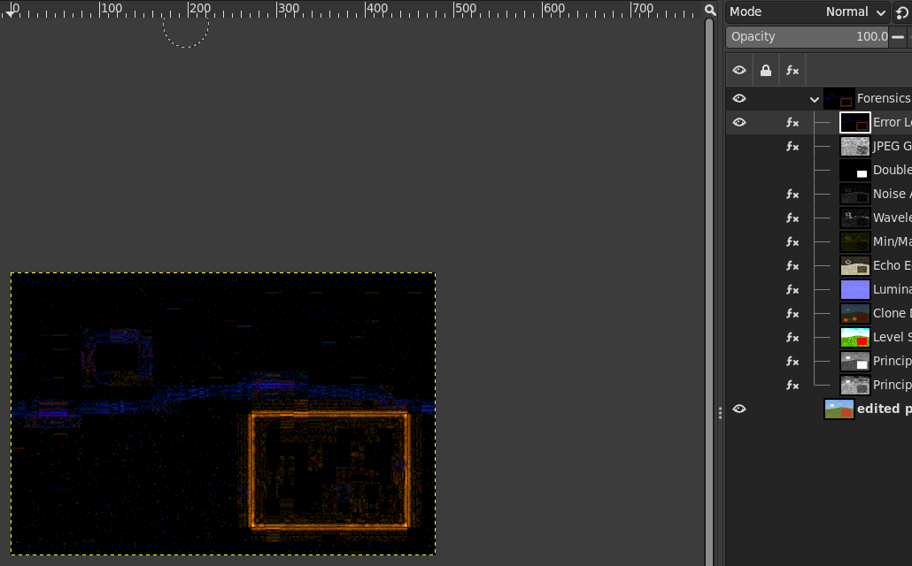

For scripts: `python-fu-forensics-workbench` with the analyses as
boolean arguments (`ela`, `ghost`, `dqmap`, `noise`, `wnoise`, `minmax`,
`echo`, `gradient`, `clone`, `median`, `resampling`, `bitplane`, `sweep`,
`pca`, `hsv`, `lab`, `thumbnail`, `jpeg-suggest`) and their main
settings.

## Building and installing

Needs meson, ninja, a C compiler, GEGL 0.4.62 or newer with its
development files, and libjpeg (libjpeg-turbo).

    meson setup build -Dmoduledir=$HOME/.local/share/gegl-0.4/plug-ins \
      -Dplugindir=$HOME/.config/GIMP/3.2/plug-ins
    ninja -C build install

For the Flatpak version of GIMP, build inside it with
[gimp-devtools](https://github.com/sandbranch/gimp-devtools),
which installs the operations into
`~/.var/app/org.gimp.GIMP/data/gegl-0.4/plug-ins`:

    gimp-build.sh . meson setup build -Dmoduledir=\$GEGL_OPDIR -Dplugindir=\$GIMP_PLUGINDIR
    gimp-build.sh . ninja -C build install

Restart GIMP after installing. On the command line:

    gegl photo.jpg -o ela.png -- forensics:error-level quality=90 scale=20

`FORENSICS_CLONE_DEBUG=1` makes Clone Detection print the shifts it found.

## Tests

None needs the network; all images are generated (no photographs), and
every GIMP, GEGL and build runs isolated from your folders
(`tests/isolate.sh`, with gimp-devtools): each script compares
your folders of GIMP and the other apps before and after, and fails if
anything changed.

- `tests/run-all.sh`: everything below, and the tests of any
  `plug-ins/<name>/tests/run.sh`.
- `tests/check.sh`: 247 pass/fail checks of the operations
  (`tests/check-*.c`, above), built and run twice, as usual and with
  AddressSanitizer and UBSan (with leak checks of this code), and every
  operation on an infinite input. The operations of the second round all
  get the same standard checks (NaN and infinities, alpha, threads, 8 and
  16 bit and linear input, pieces against the whole image, the region a
  change invalidates) besides their own.
- `tests/gimp-check.sh`: 179 checks of the filters in headless GIMP
  3.2.6: they are filters, the layer keeps its pixels, settings survive
  an XCF save and load, the results equal plain GEGL and the gegl command
  line, on float, 8 and 16 bit images; Error Level Analysis against the
  way the GIMP 2 scripts did it (GIMP's JPEG export, load, difference):
  0.024 levels apart on average (GIMP loads JPEG with the float IDCT).
- `tests/jpeg-info/run.sh`: 49 checks of JPEG Info on JPEG files that
  GIMP writes (and jpegtran, for restart markers): the report without
  GIMP (tables, qualities, signatures, the coefficient decoder against
  libjpeg's `jpeg_read_coefficients` through `tests/jpeg-coefficients.c`
  on every fixture and sample, double compression found and not found,
  the map, Exif, thumbnails, damaged files) and the plug-in in headless
  GIMP (its JSON, the thumbnail comparison and layers, the map layer).
- `tests/workbench-check.sh`: 21 checks of the Workbench in headless GIMP
  (the group, its layers, filters, settings and visibility, the photo
  untouched, the pixels, XCF, a second run, grayscale, several layers,
  the optional analyses, and a JPEG file: its qualities for ELA and JPEG
  Ghost, the map and the thumbnail in the group).
- `tests/gui/gui-test.sh`: the menus, every filter's dialog, the
  Workbench and JPEG Info (its dialog and the map it adds) in GIMP on a
  Broadway display, checked on the screenshots; `--docs` writes the
  pictures of this README.
- `tests/bench.sh`: times on a 24 megapixel image.

## Speed

A 6000 x 4000 image (24 megapixels), rendered into a float buffer, Ryzen 9
5900X (12 cores, 24 threads), GIMP's Flatpak GEGL 0.4.72:

| | 24 threads | 1 thread |
|---|---|---|
| Error Level Analysis | 0.18 s | 0.54 s |
| JPEG Ghost (11 qualities) | 0.83 s | 2.8 s |
| Noise Analysis (3 x 3 median) | 0.34 s | 4.9 s |
| Luminance Gradient | 0.14 s | 0.45 s |
| Clone Detection (reduced to 1500 x 1000) | 1.1 s | 1.8 s |
| Principal Components | 0.71 s | 0.76 s |
| Wavelet Noise Map | 0.71 s | 0.89 s |
| Min/Max Deviation | 0.18 s | 0.53 s |
| Bit Planes | 0.06 s | 0.43 s |
| Echo Edge Filter (normalised) | 1.3 s | 2.6 s |
| Median Filtering Detection | 0.23 s | 0.70 s |
| Resampling Detection (64 x 64 blocks) | 0.35 s | 3.1 s |

Error Level Analysis with auto levels takes 0.26 s (it computes the
error twice); JPEG Ghost with Farid's sweep of 61 qualities 3.9 s; the
7 x 7 median 2.1 s; Clone Detection at analysis size 4000 (3000 x 2000)
4.5 s. In GIMP the preview renders only what is shown. JPEG Info, in
Python, takes 0.1 to 3 seconds for the report of a sample (it decodes up
to 60000 blocks of luma) and 2 to 3 seconds for the double JPEG map of a
10 megapixel file (every block).

## License

GPL version 3 or later, see COPYING. The code is written for this
repository; GIMP-ELA (Alfredo Torre, MIT), elsamuko's scripts (GPL-3+),
the Gimp Forensics JPEG Ghost plug-in (GPL-3+) and Forensically (its
behaviour and published defaults) were read, not copied. The operations
and parts of JPEG Info that follow Sherloq (Copyright Guido Bartoli and
contributors, GNU GPL version 3) follow its methods and name the files;
they are written here, not copied. `plug-ins/jpeg-info/jpegsnoop-signatures.tsv`
is JPEGsnoop's signature database (Copyright 2017 Calvin Hass, GNU GPL
version 2 or later, used here under version 3 or later), and
`jpeg_report.py` follows JPEGsnoop's signature and assessment. The base
quantisation tables in `jpeg_report.py` are those of mozjpeg's
`jcparam.c` (IJG and BSD licences) and of the JPEG standard.
